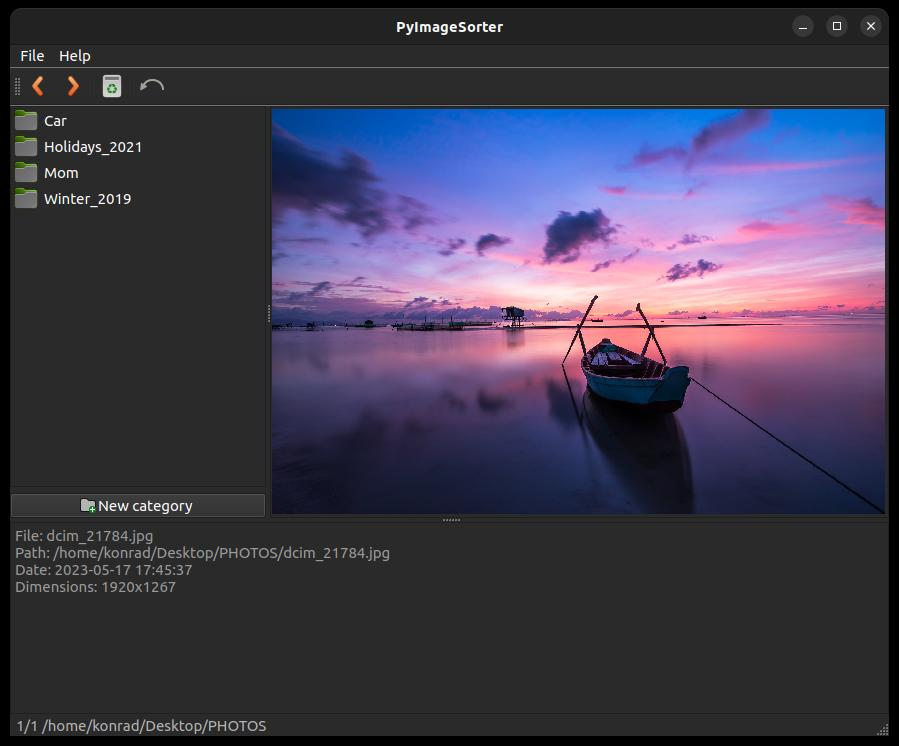

# PyImageSorter

Simple QT with python application to sort uncategorized images and photos in directory. Open directory, create subdirectories (categories), go through images and categorize them!



## Directory structure

```
root_directory
└─── Mom_birthday_2019 (1st category)
│   │   dcim_23894.jpg
│   │   dcim_25842.jpg
|
└─── Holidays_2022 (2nd category)
|   │   dcim_234.jpg
|   │   dcim_354.jpg
|
└─── ...
|
│   uncategorized_dcim_34.jpg     (  not yet categorized      )
│   uncategorized_image_543.png   (  files in root directory  )
|   ...
```

## Todo

- Moving files should be done using copy then remove rather than rename. Moving create problems when files are in different filesystems.
- Icons doesn't work on Windows. (QIcon.fromTheme)
- Loading indicator on huge directories with thousands of images.

## Dependencies:

- PySide6
